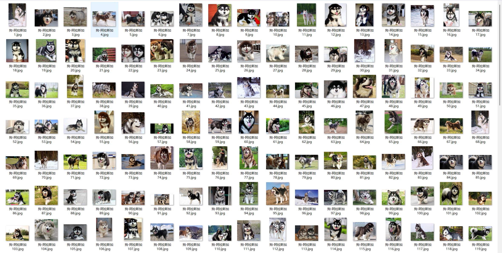
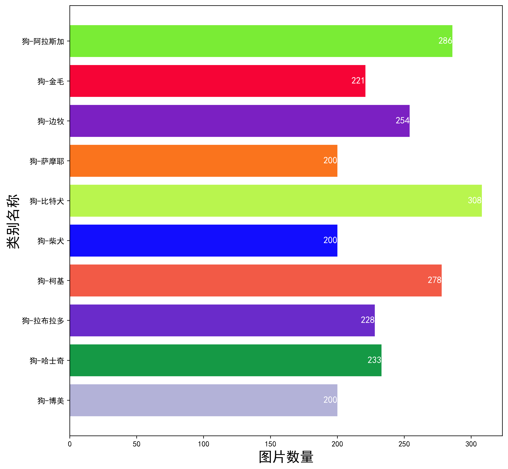
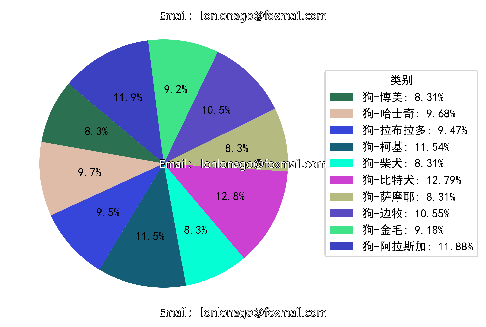

# Ten Types of Pet Dogs - Image Classification Dataset

Dataset Information Introduction: The folder "Dog-Border Collie" contains 233 images,
The folder "Dog-Labrador Retriever" contains 228 images,
The folder "Dog-Corgi" contains 278 images,
The folder "Dog-Chihuahua" contains 200 images,
The folder "Dog-Bulldog" contains 308 images,
The folder "Dog-Shiba Inu" contains 200 images,
The folder "Dog-Beagle" contains 254 images,
The folder "Dog-Golden Retriever" contains 221 images,
The folder "Dog-Alaskan Malamute" contains 286 images,
The total number of images in all subfolders is 2408.
If you have questions, just ask. I don't need to approve friend requests; you can send me messages directly, and I can see them.
When you search for me, just send your question at once, and I will reply to you. Sometimes I'm busy, so please clarify your intentions when you send your question and description.
I will also reply to you when I am free, without any formalities, which makes the response more efficient.
Phone numbers are the same as above. If I forget to reply or you are impatient, you can text or call me.

## Images

Here is a pay link on Stripe ( https://buy.stripe.com/3cs8yP7sY87d0vu9AB ). Please contact me lonlonago@foxmail.com after funding $89, and I will send you a complete data files , thank you!

